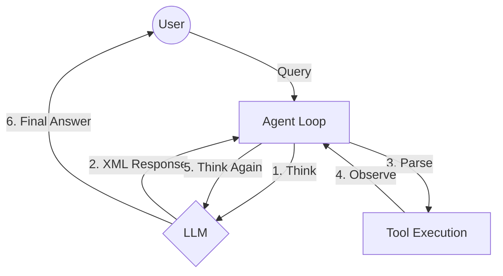

# Why Agents Think in Loops

Most people treat LLMs as chatbots: **User In -> Model Out**.

But an **Autonomous Agent** is different. It is a loop. It thinks, acts, observes the result, and thinks again.

## The Cognitive Loop (ReAct)

The core mechanism of `OmniCoreAgent` is the **ReAct (Reasoning + Acting)** loop.

### Why a Loop?

1.  **Iterative Reasoning**: The agent might not know the answer immediately. It needs to "Google it" (Tool Call), read the result (Observation), and then synthesize an answer.
2.  **Self-Correction**: If a tool fails (e.g., "API Error 500"), the agent sees the error in the Observation and can retry or choose a different tool. A linear chain would just crash.

## State Management

Because the agent loops, it needs **Memory**.

*   **Context Window**: The short-term memory. It fills up with `User -> Assistant -> Tool -> Observation` messages.
*   **Token Management**: If the loop runs too long, we hit the token limit. OmniCoreAgent handles this by summarizing old steps or truncating history.

## Reliability First

We don't trust the LLM to "just get it right." We enforce structure.

In the next lesson, we'll look at the **XML Protocol** that keeps this loop from breaking.
