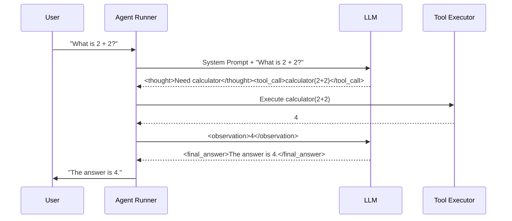

# The Agent Loop

Now that we have a running agent and understand the XML protocol, let's look at the **Loop** itself.

## The ReAct Cycle

`ReAct` stands for **Reasoning + Acting**.

1.  **Reasoning**: The agent "thinks" about the user's query (`<thought>`).
2.  **Acting**: The agent calls a tool (`<tool_call>`).
3.  **Observing**: The agent sees the tool output (`<observation>`).
4.  **Repeat**: If needed, it loops back to step 1.

## Visualizing the Loop

This loop runs inside `agent.run()`. It manages the state, tool execution, and error handling.

## Configuring the Loop

You control the loop with `AgentConfig`:

*   **max_steps**: Prevents infinite loops (default: 10). If hit, the agent stops and returns `AgentState.ERROR`.
*   **tool_call_timeout**: Limits how long a tool can run (default: 30s).
*   **loop_detector**: Detects if the agent is stuck repeating the same tool call with the same arguments.

## Handling Errors

If a tool fails (e.g., `ZeroDivisionError`), the `AgentRunner` catches it, logs it, and feeds the error back to the LLM as an `<observation>`.

This allows the agent to **Self-Heal**: "Oh, I made a mistake. Let me try again with valid arguments."
