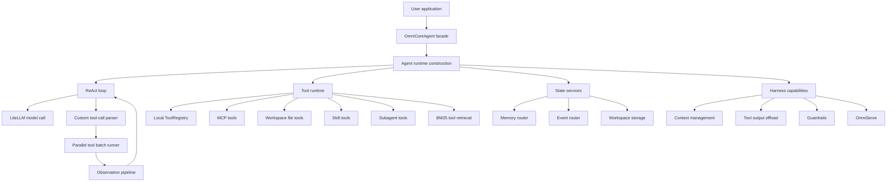

# Architecture

OmniCoreAgent is an agent harness: everything added around a model to make it
usable for real autonomous work. The model is only one part of the system. The
harness owns prompt assembly, the reasoning loop, tool resolution, parallel tool
execution, observation formatting, loop detection, memory, workspace files,
events, and serving integration.

The architecture is intentionally modular so each layer can be tested and changed
without turning the root agent class into a dump of unrelated behavior.

---

## High-Level Runtime



---

## Request Flow

<Steps>
  <Step title="Application calls run()">
    The user application calls `agent.run(query, session_id=...)`. The runtime
    loads session state and prepares the prompt for the current request.
  </Step>
  <Step title="Prompt and tool context are assembled">
    OmniCoreAgent builds the system prompt from the base instruction, harness
    rules, available tools, workspace guidance, memory policy, subagent policy,
    and BM25 tool retrieval results when enabled.
  </Step>
  <Step title="The model reasons">
    Before every LLM call, the runtime checks whether context management should
    trigger. If enabled and the configured threshold is crossed, it truncates or
    summarizes the message history before LiteLLM sends the prompt to the
    provider. The model returns either a final answer or one or more tool calls
    using OmniCoreAgent's tool-call contract.
  </Step>
  <Step title="Tool calls are parsed and resolved">
    The parser extracts tool calls. The resolver maps each call to the right
    executor: local Python tool, MCP tool, skill, workspace tool, or harness tool.
  </Step>
  <Step title="Independent tools run as a batch">
    The batch runner executes the resolved tools concurrently with a per-tool
    timeout. Successes and failures are collected together.
  </Step>
  <Step title="Results become one observation">
    The observation pipeline normalizes the batch result, applies guardrails,
    offloads large payloads to the active workspace when configured, and creates the
    observation text that returns to the model.
  </Step>
  <Step title="Loop detection checks progress">
    Tool-call signatures are recorded so the runtime can detect repeated calls or
    repeated tool interaction patterns beyond max step
    limits.
  </Step>
  <Step title="The loop continues or answers">
    The model receives the structured observation and either continues with more
    tool work or returns the final response.
  </Step>
</Steps>

---

## Core Layers

### 1. Public Facade

`OmniCoreAgent` is the API application builders use. It owns the user-facing
constructor, `run()`, MCP connection helpers, history helpers, runtime switching,
metrics, and cleanup.

The facade should stay thin. Construction and runtime behavior live in dedicated
modules so the agent entry point remains easy to read.

### 2. Runtime Construction

The runtime construction layer normalizes:

- model configuration
- MCP tool configuration
- agent configuration
- memory and event routers
- workspace configuration
- harness capability setup

This is where defaults are resolved. For example, workspace files are enabled by
default, context management and tool offload are disabled by default, and enabling
subagents forces workspace files on.

### 3. ReAct Loop

The loop controls the actual agent execution:

```text
messages -> model -> tool calls -> batch execution -> observation -> model
```

The loop is also where max steps, request limits, token limits, context
management, memory updates, and final response handling are enforced. Context
management runs before the model call, so a configured token budget reduces the
prompt before the provider context window is hit.

### 4. Tool Runtime

Tools come from several sources but are exposed to the model through one runtime
view:

| Source | Purpose |
|--------|---------|
| Local tools | Application-owned Python functions registered with `ToolRegistry`. |
| MCP tools | External tool servers over stdio, SSE, or Streamable HTTP. |
| Workspace tools | File operations for notes, scratchpads, artifacts, and offloads. |
| Skills | Packaged capabilities implemented in Python, Bash, or Node.js. |
| Subagent tools | Harness tools that let the lead agent spawn focused workers. |
| BM25 retrieval | Optional tool filtering when the full tool set is too large for the prompt. |

The model should not need to know where a tool came from. The resolver maps tool
names to the right executor.

### 5. Parallel Batch Runner

The batch runner is responsible for executing all tool calls from a model step
together:

- assigns stable tool call IDs
- emits start/result/error events
- runs calls concurrently
- applies the configured timeout
- preserves individual success and failure results
- passes the combined result into the observation pipeline

This layer is one of the core differences between OmniCoreAgent and a basic
sequential tool loop.

### 6. Observation Pipeline

The observation pipeline protects the next reasoning step from raw, noisy tool
output.

```text
raw tool results
  -> normalized tool result objects
  -> guardrail screening
  -> workspace offload when configured
  -> compact observation text
```

The model gets enough information to continue the task and a workspace reference
when a large payload was offloaded.

### 7. State Services

State is split by responsibility:

| Service | Responsibility |
|---------|----------------|
| Memory router | Conversation/session history. |
| Event router | Runtime events for runs, tool calls, streaming, and service integrations. |
| Workspace storage | Files used by agents, subagents, tools, artifacts, scratchpads, and offloaded payloads. |

Workspace storage is separate from memory storage. Memory stores conversation
state. Workspace stores files. A project can use Redis for memory and local disk,
S3, or R2 for workspace files.

### 8. Serving Layer

OmniServe wraps an OmniCoreAgent instance with production HTTP/SSE boundaries:

- app lifecycle
- request serialization
- streaming route helpers
- health and metrics routes
- CORS and error middleware
- shared server state

The dependency points one way: OmniServe wraps the agent runtime, while the agent
runtime stays independent of the serving package.

---

## Design Invariants

These rules keep the architecture clean:

- MCP connects external MCP server tools into OmniCoreAgent's tool runtime.
  Those MCP tools are resolved and executed beside local tools, workspace tools,
  skills, and harness tools.
- Workspace storage is the only filesystem surface for harness files: notes,
  scratchpads, artifacts, subagent output, and tool offloads.
- Memory storage and workspace storage are different concepts and should not
  share naming that makes users confuse them.
- Tool output should not go straight to the model. It must pass through the
  observation pipeline.
- Subagents must write useful output into the workspace so the lead agent can
  inspect it later.
- Optional production backends belong behind routers or storage interfaces, not
  inside the root agent class.
- Public docs should separate default behavior from opt-in capability.

---

## Runtime Boundaries

OmniCoreAgent is the in-process agent harness. The surrounding production
boundaries are handled by the layer designed for that job:

- Use **OmniServe** when you need REST/SSE access to an agent.
- Use **OmniDaemon** when you need event-driven, supervised, process-isolated
  agents running as autonomous infrastructure services.
- Use your own application infrastructure when you only need a direct script or a
  direct function call around one model request.

This separation keeps OmniCoreAgent focused: it builds the agent harness cleanly,
then integrates with the right outer runtime when the deployment needs it.
