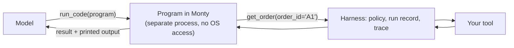

# Code Mode

With code mode, the agent gets a `run_code` tool. Instead of calling tools one
at a time, one model step at a time, the model writes a short Python program
that calls them as functions, loops, filters and computes, and gets back the
program's result and what it printed. Four lookups that would take four calls
take one.



<Info>
Needs the `codemode` extra. Every output on this page is what the code printed
when it was run; the program the model writes, and its wording, will differ on
your run.
</Info>

```bash
pip install "omnicoreagent[codemode]"
```

## A program instead of four calls

```python
import asyncio
from omnicoreagent import OmniCoreAgent, ToolRegistry

tools = ToolRegistry()
ORDERS = {
    "A1": {"id": "A1", "status": "shipped", "days_in_transit": 9},
    "A2": {"id": "A2", "status": "shipped", "days_in_transit": 2},
    "A3": {"id": "A3", "status": "shipped", "days_in_transit": 12},
    "A4": {"id": "A4", "status": "open", "days_in_transit": 0},
}

@tools.register_tool("list_orders")
def list_orders(status: str) -> list:
    """List the IDs of the orders with a status: open or shipped."""
    return [order_id for order_id, order in ORDERS.items() if order["status"] == status]

@tools.register_tool("get_order")
def get_order(order_id: str) -> dict:
    """Get one order, with how many days it has been in transit."""
    return ORDERS[order_id]

async def main():
    agent = OmniCoreAgent(
        name="analyst",
        system_instruction="Answer questions about orders. Answer in plain text, in one sentence.",
        model_config={"provider": "openai", "model": "gpt-5.4-mini"},
        local_tools=tools,
        agent_config={
            "code_mode": {
                "enabled": True,
                "tools": ["list_orders", "get_order"],
                "max_tool_calls": 50,
            },
        },
    )
    result = await agent.run(
        "Which shipped orders have been in transit for more than 7 days? Use run_code."
    )
    print(result["response"])

    trajectory = await agent.get_trajectory(result["trace_id"])
    for step in trajectory["steps"]:
        for call in step["tool_calls"]:
            print("step", step["step"], "->", call["tool_name"], call["outcome"])
            if call["tool_name"] == "run_code":
                print(call["arguments"]["code"])
            for inner in call.get("code_calls", []):
                print("   ", inner["tool_call_id"], inner["tool_name"], inner["arguments"], inner["outcome"])
    await agent.cleanup()

asyncio.run(main())
```

```text
Shipped orders in transit for more than 7 days are A1 (9 days) and A3 (12 days).
step 1 -> run_code success
shipped = list_orders(status='shipped')
result = []
for oid in shipped:
    order = get_order(order_id=oid)
    days = order.get('days_in_transit') if isinstance(order, dict) else None
    if days is not None and days > 7:
        result.append((oid, days))
result
    call_pJwGyluJODGpGR0On2C4ckaP.1 list_orders {'status': 'shipped'} success
    call_pJwGyluJODGpGR0On2C4ckaP.2 get_order {'order_id': 'A1'} success
    call_pJwGyluJODGpGR0On2C4ckaP.3 get_order {'order_id': 'A2'} success
    call_pJwGyluJODGpGR0On2C4ckaP.4 get_order {'order_id': 'A3'} success
```

One model step made four tool calls. Each is in the trajectory under its
`run_code` call (`code_calls`), with an ID of the form
`<run_code call ID>.<n>`, its arguments, its outcome and its own policy
decision.

The prompt says "Use run_code" to make the example certain; the model
decides for itself when a program is worth it, and still calls tools directly
when one call will do.

## How it works

- **What the model is told.** `run_code`'s description lists each tool the
  program may call as a Python signature with its description, and the
  limits. Tools are called like Python functions, with keyword arguments or in the
  order of their parameters; each returns the tool's
  result data, or raises an error the program can catch. The value of the last
  expression is returned, with everything printed.
- **Where it runs.** Programs run in [Monty](https://github.com/pydantic/monty)
  1.x, Pydantic's interpreter for a subset of Python, in a separate worker
  process. A program has no filesystem, network or environment access, and
  cannot sleep: an attempt raises an error inside the program. The clock and
  random numbers work. Third-party packages cannot be imported.
- **Each tool call is a real tool call.** It goes through the same path as a
  call the model makes: its arguments are checked against the schema,
  governance decides it (a denied call raises inside the program), the run's
  record notes it before it starts, and it is traced.
- **Limits.** A program is stopped at its time limit, memory limit or
  tool-call limit, and its printed output is capped.
- **Governance.** Running a program is its own capability, `code.run`. The
  `interactive-dev` and `permissive-dev` profiles allow it; `strict-production`
  needs a rule. Each tool the program calls is then decided on its own.

## Options

Set under `agent_config["code_mode"]`:

| Key | Default | What it does |
|---|---|---|
| `enabled` | `False` | Add the `run_code` tool. |
| `tools` | every eligible tool | The tool names a program may call. A tool whose name is not a Python identifier (such as one with a `-`) cannot be called from a program. |
| `max_duration_seconds` | `30` | The program's own compute time. The clock stops while a tool runs; each tool call has the agent's `tool_call_timeout`. |
| `max_memory_bytes` | `268435456` (256 MiB) | Memory the program may use. |
| `max_tool_calls` | `50` | Tool calls one program may make. |
| `max_output_bytes` | `65536` | Printed output kept. |
| `snapshot_key` | none | Signs a program paused for approval, so it can continue in another process ([below](#approval-inside-a-program)). `OMNICOREAGENT_CODE_SNAPSHOT_KEY` works too. |
| `max_snapshot_bytes` | `4194304` (4 MiB) | Largest paused program that can be stored. |

Every other agent setting is in the
[agent settings reference](/docs/reference/agent-config).

## Approval inside a program

When a tool the program calls needs a person, the **program** pauses: it is
stored, signed, on the run's record, and the run waits like any other
([Durable Runs](/docs/core-concepts/durable-runs)). After the decision, the
program continues **from that call**. Nothing it already did runs again.

```python
import asyncio
from omnicoreagent import OmniCoreAgent, ToolRegistry
from omnicoreagent.governance import PolicyEffect, PolicyRule, build_default_policy

tools = ToolRegistry()
ORDERS = {"A1": 9, "A2": 2, "A3": 12}  # order ID -> days in transit
REFUNDED = []

@tools.register_tool("list_late_orders")
def list_late_orders(days: int) -> list:
    """List the IDs of shipped orders in transit for more than this many days."""
    return [order_id for order_id, age in ORDERS.items() if age > days]

@tools.register_tool("issue_refund")
def issue_refund(order_id: str) -> dict:
    """Refund an order in full."""
    REFUNDED.append(order_id)
    return {"order_id": order_id, "refunded": True}

policy = build_default_policy("interactive-dev")
policy.rules.ask.append(
    PolicyRule(rule_id="ask_before_refunds", effect=PolicyEffect.ASK,
               capability="tool.local.call", target={"tool_name": "issue_refund"})
)

async def main():
    agent = OmniCoreAgent(
        name="refunds",
        system_instruction="You handle late orders. Answer in plain text, in one sentence.",
        model_config={"provider": "openai", "model": "gpt-5.4-mini"},
        local_tools=tools,
        agent_config={
            "code_mode": {"enabled": True},
            "governance_config": {"enabled": True, "policy": policy},
        },
    )
    result = await agent.run(
        "Refund every order in transit for more than 7 days, with one run_code program."
    )
    while result["status"] == "awaiting_approval":
        for approval in result["approvals"]:
            print("waiting on:", approval["tool_name"], approval["tool_call_id"], approval["arguments"])
            await agent.resolve_approval(
                result["run_id"], approval["approval_id"], decision="approve", approver="alice"
            )
        result = await agent.resume(result["run_id"])
    print(result["status"], "-", result["response"])
    print("refunded:", REFUNDED)
    await agent.cleanup()

asyncio.run(main())
```

```text
waiting on: issue_refund call_X7FKn8xwH1APDbzbQ5VrAqvd.2 None
waiting on: issue_refund call_X7FKn8xwH1APDbzbQ5VrAqvd.3 None
success - Refunded every order in transit for more than 7 days.
refunded: ['A1', 'A3']
```

The program paused at its first refund (call `.2`), continued from there
after the approval, and paused again at the second (`.3`). Nothing before a
pause ran again: each order was refunded exactly once.

<Warning>
For a call made from a program, `approval["arguments"]` is `None`: the
approval names the call (`tool_call_id`, `tool_name`, `capability`,
`target`), not the arguments the program passed. If an approver must see the
arguments, have the model call that tool directly rather than from a program.
</Warning>

A **denied** call raises inside the program with the approver's note, so the
program can catch it and carry on.

**Across processes.** Set `snapshot_key` (or
`OMNICOREAGENT_CODE_SNAPSHOT_KEY`) so a paused program can continue in another
process, such as after a restart, with a durable memory store. A stored
program that does not verify against the key is refused and never runs.
Without a key, a random one is made per process, so a paused program can
only continue in the process where it paused. A program too large to store
(`max_snapshot_bytes`) is told so instead of pausing, and can call the tool
directly.

## When things go wrong

A program's errors go back to the model as the `run_code` call's error, so it
can fix the program and try again. These are the messages it gets.

<AccordionGroup>
  <Accordion title="code mode requires optional dependency 'pydantic_monty'">
    The extra is not installed. The agent is created without complaint; the
    first program fails with:

    ```text
    ImportError: code mode requires optional dependency 'pydantic_monty'. Install it with: pip install 'omnicoreagent[codemode]'
    ```

    Install it: `pip install "omnicoreagent[codemode]"`.
  </Accordion>

  <Accordion title="ValueError: code_mode has unknown keys">
    Raised when the agent is created, for a misspelt key or a wrong value:

    ```text
    ValueError: code_mode has unknown keys: max_calls
    ValueError: code_mode.tools must be a list of tool names
    ValueError: code_mode.max_tool_calls must be positive
    ```
  </Accordion>

  <Accordion title="The program was stopped: it may make at most N tool calls">
    With `max_tool_calls` 3, a loop of ten calls ended with:

    ```text
    The program was stopped: it may make at most 3 tool calls.
    ```

    Raise `max_tool_calls`, or give the model a tool that does the batch in
    one call.
  </Accordion>

  <Accordion title="TimeoutError: feed time limit exceeded">
    The program computed for longer than `max_duration_seconds` (2 here):

    ```text
    TimeoutError: feed time limit exceeded: 2.00672274s > 2s
    ```
  </Accordion>

  <Accordion title="PermissionError, 'not supported in this environment', ModuleNotFoundError">
    The program reached outside its sandbox. These come back as the
    program's traceback, ending in:

    ```text
    PermissionError: Permission denied: '/etc/passwd'
    RuntimeError: 'os.environ' is not supported in this environment
    ModuleNotFoundError: No module named 'httpx'
    ```

    This is the sandbox working. Give the program a tool for what it needs.
  </Accordion>
</AccordionGroup>

## Next

<CardGroup cols={2}>
  <Card title="Local tools" icon="wrench" href="/docs/core-concepts/local-tools">
    The functions a program calls.
  </Card>
  <Card title="Durable runs" icon="clock-rotate-left" href="/docs/core-concepts/durable-runs">
    Pause, approve, resume, and recover after a crash.
  </Card>
  <Card title="Security model" icon="shield-halved" href="/docs/core-concepts/security-model">
    Policies, sandboxes, and what each one guarantees.
  </Card>
  <Card title="Read the trajectory" icon="magnifying-glass-chart" href="/docs/how-to-guides/observability">
    Every program and every call it made, on the record.
  </Card>
</CardGroup>
