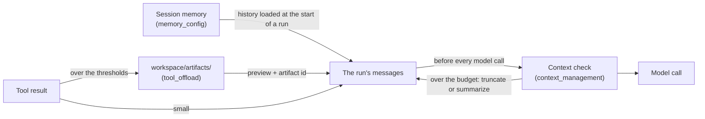

# Context Engineering

A long task fills the model's context: a 9,000-token log from one tool, forty
steps of tool calls. By the end of this page you will have seen the two things
the runtime does about it, both **on by default**: a large tool result is saved
to the workspace and the model gets a preview it can search, and a run's
messages are trimmed — or summarized — *before* a model call would go over
your budget.

<Info>
Every output on this page is what the code printed when it was run with
`gpt-5.4-mini`. The model's wording, and which artifact tool it picks, will
differ on your run.
</Info>

There are three layers. The first is covered on the [Memory](/docs/core-concepts/memory) page.



| Layer | Setting | When it acts | Default |
|---|---|---|---|
| Session memory | `memory_config` | When a run starts: how much of the session's history it is given | last 10,000 messages |
| Tool output offloading | `tool_offload` | When one tool result is over 2,000 bytes or 500 tokens | on |
| In-run context management | `context_management` | Before each model call, when the run's messages cross the threshold | on: 75% of 100,000 tokens, truncate |

## A large tool result, offloaded

This tool returns a 400-line log — about 9,200 tokens. Nothing is configured:

```python
import asyncio
import json
from omnicoreagent import OmniCoreAgent, ToolRegistry

tools = ToolRegistry()

@tools.register_tool("fetch_server_log")
def fetch_server_log() -> str:
    """Return today's server log."""
    lines = []
    for i in range(1, 401):
        level = "ERROR" if i in (137, 288) else "INFO"
        message = "disk quota exceeded on /var/data" if i == 288 else (
            "payment gateway timeout after 30s" if i == 137 else "request served in 12ms"
        )
        lines.append(f"2026-09-26T10:{i // 60:02d}:{i % 60:02d} {level} line={i} {message}")
    return "\n".join(lines)

async def main():
    agent = OmniCoreAgent(
        name="log_reader",
        system_instruction=(
            "You investigate server logs. When a result was offloaded, search the "
            "artifact instead of reading all of it. Answer in plain text, without markdown."
        ),
        model_config={"provider": "openai", "model": "gpt-5.4-mini"},
        local_tools=tools,
    )
    result = await agent.run("Fetch the server log and tell me every ERROR line, in one sentence each.")
    print(result["response"])

    trajectory = await agent.get_trajectory(result["trace_id"])
    for step in trajectory["steps"]:
        for call in step["tool_calls"]:
            print("step", step["step"], "->", call["tool_name"], call["arguments"])
    first = trajectory["steps"][0]["tool_calls"][0]
    seen = json.loads(first["observation"]["content"])["data"].splitlines()
    print("--- what the model saw from fetch_server_log ---")
    print("\n".join(seen[:7] + ["..."] + seen[-2:]))
    await agent.cleanup()

asyncio.run(main())
```

```text
2026-09-26T10:02:17 ERROR line=137 payment gateway timeout after 30s.
2026-09-26T10:04:48 ERROR line=288 disk quota exceeded on /var/data.
step 1 -> fetch_server_log {}
step 2 -> search_artifact {'artifact_id': 'fetch_server_log_20260926_135637_1ed1e1ff', 'query': 'ERROR'}
--- what the model saw from fetch_server_log ---
[TOOL RESPONSE OFFLOADED]
Tool: fetch_server_log
Artifact ID: fetch_server_log_20260926_135637_1ed1e1ff
Original size: 9201 tokens → Preview: 163 tokens (saved 9038 tokens)

--- PREVIEW ---
2026-09-26T10:00:01 INFO line=1 request served in 12ms
...
📁 Full response saved to: …/workspace/artifacts/fetch_server_log_20260926_135637_1ed1e1ff.txt
💡 Use read_artifact('fetch_server_log_20260926_135637_1ed1e1ff') to load full content when needed.
```

(The saved-to path is shortened here; it is the absolute path of your
`workspace/artifacts/` folder.)

The model was sent 163 tokens instead of 9,201, found the two errors with
`search_artifact`, and the full log stayed on disk. Without the instruction
to search, the model on another run called `read_artifact` and loaded the
whole log back into its context — say in the system instruction how you want
large results handled.

## A long run, trimmed before each model call

Here the budget is made tiny on purpose, so it is crossed on a six-item task:
`sliding_window` counts messages, and the run acts once it holds more than 6.

```python
import asyncio
from omnicoreagent import OmniCoreAgent, ToolRegistry

PRICES = {"apples": 3.20, "bread": 2.50, "cheese": 6.75, "dates": 4.10, "eggs": 3.90, "flour": 1.80}
tools = ToolRegistry()

@tools.register_tool("lookup_price")
def lookup_price(item: str) -> dict:
    """Look up the price of one grocery item."""
    return {"item": item, "price": PRICES.get(item.lower())}

async def main():
    agent = OmniCoreAgent(
        name="shopper",
        system_instruction="You price shopping lists. Answer in plain text, without markdown.",
        model_config={"provider": "openai", "model": "gpt-5.4-mini"},
        local_tools=tools,
        agent_config={
            "context_management": {
                "mode": "sliding_window",   # count messages, not tokens
                "value": 6,                 # act when the run holds more than 6
                "strategy": "summarize_and_truncate",
                "preserve_recent": 4,
            }
        },
    )
    result = await agent.run(
        "Look up apples, bread, cheese, dates, eggs and flour one at a time, "
        "waiting for each price before the next, then give me the total."
    )
    print(result["response"])

    trajectory = await agent.get_trajectory(result["trace_id"])
    for step in trajectory["steps"]:
        for entry in step["context"]:
            if entry["type"] == "context_compression":
                print(
                    f"step {step['step']}: context reduced from "
                    f"{entry['before']['message_count']} to {entry['after']['message_count']} messages"
                )
    await agent.cleanup()

asyncio.run(main())
```

```text
The total cost is 22.25.
step 4: context reduced from 8 to 6 messages
step 5: context reduced from 8 to 6 messages
step 6: context reduced from 8 to 6 messages
step 7: context reduced from 8 to 6 messages
```

The total is right although the early prices had left the context: before
each of steps 4 to 7, the older messages were replaced by one summary, keeping
the system prompt and the 4 most recent messages (8 → system prompt + summary
+ 4). With `"strategy": "truncate"` they would simply be dropped. Each
reduction is in the trajectory, with digests of the messages before and after.

## How it works

**Offloading.** After a tool returns, its result is measured. Over
`threshold_bytes` *or* `threshold_tokens`, the full result is written to
`workspace/artifacts/` (or your S3/R2 workspace) and the model's observation
becomes the preview above: the first `max_preview_lines` lines, cut to
`max_preview_tokens`. Results of the workspace file tools and the artifact
tools themselves are never offloaded. While offloading is on, the model has
four tools to reach the rest:

| Tool | Does |
|---|---|
| `read_artifact(artifact_id)` | returns the whole result |
| `tail_artifact(artifact_id, lines=50)` | the last lines — for logs |
| `search_artifact(artifact_id, query)` | the matching lines |
| `list_artifacts()` | what has been offloaded |

**Context management.** Before every model call, the run's messages are
measured: in `token_budget` mode, tokens against `threshold_percent` of
`value`; in `sliding_window` mode, the number of messages (not counting the
system prompt) against `value`. Over it, the messages between the system prompt
and the `preserve_recent` latest are dropped (`truncate`), or summarized by
one extra model call into a single message (`summarize_and_truncate`). A
tool call and its results are kept or dropped together. If the summary call
fails, the run truncates instead and carries on.

Set `value` below your model's real context window: the check happens before
the call, so the provider never sees an oversized prompt.

## Options

| Setting | Default | What it does |
|---|---|---|
| `context_management.enabled` | `True` | Check the run's messages before each model call. |
| `context_management.mode` | `"token_budget"` | `token_budget` (tokens) or `sliding_window` (messages). |
| `context_management.value` | `100000` | The token budget, or the most messages. |
| `context_management.threshold_percent` | `75` | `token_budget` acts past this share of `value` (1–100). |
| `context_management.strategy` | `"truncate"` | `truncate`, or `summarize_and_truncate` (one extra model call). |
| `context_management.preserve_recent` | `4` | The latest messages always kept; at least 4. |
| `tool_offload.enabled` | `True` | Save large tool results to the workspace. |
| `tool_offload.threshold_bytes` / `threshold_tokens` | `2000` / `500` | Over either one, the result is offloaded. |
| `tool_offload.max_preview_lines` / `max_preview_tokens` | `10` / `150` | The size of the preview the model gets. |
| `memory_config.mode` / `value` | `"sliding_window"` / `10000` | History a run starts with: the latest `value` messages, or (`token_budget`) up to `value` tokens. See [Memory](/docs/core-concepts/memory). |

```python
agent_config = {
    "memory_config": {"mode": "token_budget", "value": 20000},
    "context_management": {
        "mode": "token_budget",
        "value": 100000,
        "threshold_percent": 75,
        "strategy": "summarize_and_truncate",
        "preserve_recent": 6,
    },
    "tool_offload": {"threshold_tokens": 1000, "threshold_bytes": 4000},
}
```

A partial dictionary is merged with the defaults. With
[`enable_subagents`](/docs/core-concepts/sub-agents), context management and
offloading are switched on for the lead and every worker, whatever you set,
keeping your other values. Every setting is in the
[agent settings reference](/docs/reference/agent-config).

## When things go wrong

<AccordionGroup>
  <Accordion title="ValueError: context_management.preserve_recent must be at least 4, got 2">
    The latest four messages are always kept, so the model never loses the
    call it just made and its result. Use 4 or more.
  </Accordion>
  <Accordion title="ValueError: context_management.strategy must be one of {'truncate', 'summarize_and_truncate'}, got 'summarize'">
    The two strategies are `truncate` and `summarize_and_truncate`. The same
    kind of message comes for `mode` (`token_budget` or `sliding_window`),
    `threshold_percent` (1–100), and a `value` or `tool_offload` threshold
    that is not positive: `tool_offload.threshold_tokens must be positive, got 0`.
    The order of the names inside `{...}` can change from run to run.
  </Accordion>
  <Accordion title="ValueError: Invalid memory mode: last_n. Must be one of {'sliding_window', 'token_budget'}.">
    `memory_config.mode` is checked when the agent starts — on its first
    `run()`, not when it is built. Use `sliding_window` or `token_budget`.
  </Accordion>
  <Accordion title="The model reads the whole artifact back">
    An offloaded result is only saved if the model does not load all of it
    again. Tell it how to use large results ("search the artifact instead of
    reading all of it"), or raise `threshold_bytes` and `threshold_tokens` for
    results the model does need whole.
  </Accordion>
  <Accordion title="The agent forgets something from early in a long run">
    With `truncate`, what falls out of the window is gone for that run. Use
    `summarize_and_truncate`, raise `value`, or have the agent write what it
    must keep to a workspace file ([Workspace files](/docs/core-concepts/workspace-files)),
    which no trimming touches.
  </Accordion>
</AccordionGroup>

## Next

<CardGroup cols={2}>
  <Card title="Memory" icon="database" href="/docs/core-concepts/memory">
    Session history across runs, in the database you choose, with summaries.
  </Card>
  <Card title="Workspace files" icon="folder-open" href="/docs/core-concepts/workspace-files">
    Where offloaded results and the agent's own files live.
  </Card>
  <Card title="Sub-agents" icon="users" href="/docs/core-concepts/sub-agents">
    Split a big task so no single context has to hold it all.
  </Card>
  <Card title="Observability" icon="magnifying-glass-chart" href="/docs/how-to-guides/observability">
    Every compression and offload is in the run's trajectory.
  </Card>
</CardGroup>
