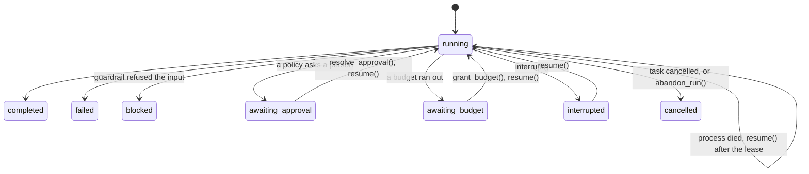

# Durable Runs

Every `agent.run(...)` saves a **run record** as it goes: its status, its
step, each tool call's state, its approvals and its usage. By the end of this
page you will have a run whose process was killed in the middle of charging a
card, picked up by another process that knows the charge may already have
happened.

<Info>
Every output on this page is what the code printed when it was run. The
model's wording, the ids and the timestamps will differ on your run.
</Info>



## A run's record

```python
import asyncio
from omnicoreagent import OmniCoreAgent, ToolRegistry

tools = ToolRegistry()

@tools.register_tool("get_invoice", idempotent=True)
def get_invoice(invoice_id: str) -> dict:
    """Fetch an invoice."""
    return {"invoice_id": invoice_id, "amount": 120.0, "status": "unpaid"}

async def main():
    agent = OmniCoreAgent(
        name="billing",
        system_instruction="You look up invoices. Answer in plain text, in one sentence.",
        model_config={"provider": "openai", "model": "gpt-5.4-mini"},
        local_tools=tools,
    )
    result = await agent.run("Is invoice INV-7 paid?", session_id="acct-42")
    print(result["status"], "|", result["response"])

    run = await agent.get_run(result["run_id"])
    for key in ("run_id", "session_id", "status", "step", "attempt", "trace_ids", "usage"):
        print(f"{key}: {run[key]}")
    for call in run["tool_calls"]:
        print("call:", call["tool_name"], call["state"], call["outcome"])

    runs = await agent.list_runs(session_id="acct-42")
    print("runs in session:", [(r["run_id"], r["status"]) for r in runs])
    await agent.cleanup()

asyncio.run(main())
```

```text
success | Invoice INV-7 is unpaid.
run_id: run_bcdec4a2ad314260b9b616e9334fc4fe
session_id: acct-42
status: completed
step: 2
attempt: 1
trace_ids: ['trace_69d42e3dac47424ab6b3e5340330fcde']
usage: {'requests': 2, 'request_tokens': 3026, 'response_tokens': 32, 'total_tokens': 3058}
call: get_invoice completed success
runs in session: [('run_bcdec4a2ad314260b9b616e9334fc4fe', 'completed')]
```

Nothing was configured: every agent keeps run records in its memory store.
The record also holds the run's own working context (the history it started
from and the messages it added), its approvals and budget requests, and the
tool calls' arguments as a digest, not in full. `run()` returns the `run_id`;
`get_run(run_id)` reads the record and `list_runs(session_id=, status=, limit=100)`
lists records, oldest first.

The default store is in memory, so here the record dies with the process. To
resume a run anywhere else, the store must be one both processes reach:
SQLite, PostgreSQL, Redis or MongoDB ([Stores and
scale](/docs/how-to-guides/stores-and-scale)).

## Survive a crash

A payment agent starts charging a card. The provider is slow, and the process
is killed before the reply arrives. Did the charge happen? The run record
knows the call **started** and never **finished**, and a second process takes
the run over without charging twice.

<Steps>
  <Step title="One definition, imported by both processes">
    ```python
    # agent_def.py
    import asyncio
    import json
    import os
    from pathlib import Path

    os.environ.setdefault("DATABASE_URL", "sqlite:///./runs.db")

    from omnicoreagent import MemoryRouter, OmniCoreAgent, ToolRegistry

    LEDGER = Path("charges.jsonl")  # stands in for the payment provider's records
    tools = ToolRegistry()

    @tools.register_tool("charge_card")
    async def charge_card(order_id: str, amount: float) -> dict:
        """Charge the customer's card for an order."""
        with LEDGER.open("a") as ledger:
            ledger.write(json.dumps({"order_id": order_id, "amount": amount}) + "\n")
        await asyncio.sleep(30)  # a slow provider: the charge is made, the reply is late
        return {"order_id": order_id, "charged": amount}

    @tools.register_tool("list_charges", idempotent=True)
    def list_charges(order_id: str) -> dict:
        """List the charges already made for an order."""
        lines = LEDGER.read_text().splitlines() if LEDGER.exists() else []
        return {"charges": [c for c in map(json.loads, lines) if c["order_id"] == order_id]}

    def build_agent() -> OmniCoreAgent:
        return OmniCoreAgent(
            name="payments",
            system_instruction=(
                "You take payments. Never charge an order twice. "
                "Answer in plain text, in one sentence."
            ),
            model_config={"provider": "openai", "model": "gpt-5.4-mini"},
            local_tools=tools,
            memory_router=MemoryRouter("sql"),
            agent_config={"run_lease_seconds": 15},
        )
    ```

    SQLite needs `pip install "omnicoreagent[postgres]"` (it brings SQLAlchemy).
  </Step>
  <Step title="Process one: start the charge, then die">
    ```python
    # start.py
    import asyncio
    from agent_def import build_agent

    async def main():
        agent = build_agent()
        await agent.run("Charge order 1042 for 42 dollars.", run_id="run_order_1042")

    asyncio.run(main())
    ```

    ```bash
    python start.py & PID=$!
    until [ -f charges.jsonl ]; do sleep 0.5; done   # the charge is made...
    kill -9 $PID                                      # ...and the process dies before the reply
    ```
  </Step>
  <Step title="Process two: take the run over">
    ```python
    # recover.py
    import asyncio
    from agent_def import build_agent

    RUN_ID = "run_order_1042"

    async def main():
        agent = build_agent()
        run = await agent.get_run(RUN_ID)
        print("found:", run["status"], "| heartbeat:", run["heartbeat_at"])
        for call in run["tool_calls"]:
            print("  call:", call["tool_name"], call["state"])

        while True:
            try:
                result = await agent.resume(RUN_ID)
                break
            except ValueError as still_live:
                print(still_live)
                await asyncio.sleep(5)

        print(result["status"], "|", result["response"])
        run = await agent.get_run(RUN_ID)
        for call in run["tool_calls"]:
            print("  call:", call["tool_name"], call["state"], call["outcome"])
        print("charges made:", open("charges.jsonl").read().count("\n"))
        await agent.cleanup()

    asyncio.run(main())
    ```

    ```text
    found: running | heartbeat: 2026-09-27T23:03:34.553926+00:00
      call: list_charges completed
      call: charge_card started
    Run run_order_1042 is running in another process (its heartbeat is current)
    Run run_order_1042 is running in another process (its heartbeat is current)
    Run run_order_1042 is running in another process (its heartbeat is current)
    success | Order 1042 has been charged $42.
      call: list_charges completed success
      call: charge_card completed unknown
      call: list_charges completed success
    charges made: 1
    ```
  </Step>
</Steps>

- The dead process left the record `running`, with `charge_card` `started`.
- Until its heartbeat was 15 seconds old (`run_lease_seconds`), `resume`
  refused: from outside, a dead process and a busy one look the same.
- `charge_card` is not idempotent, so it was **not** run again. The model was
  told its outcome is unknown, checked with `list_charges`, found the charge
  and answered. One charge, not two. The call's `outcome` is `unknown`.
- `list_charges`, completed before the crash, was not run again: its result
  was already in the run's context. (The second `list_charges` is the model's
  own check.)

## How it works

<Steps>
  <Step title="Saved as it goes">
    The record is written when the run starts, at each step, before each tool
    call (`started`, a write-ahead) and after it (`completed`), at every
    approval or budget request, and when the run ends. A tool's result is
    saved with it, so a resumed run never needs to call it again.
  </Step>
  <Step title="A heartbeat, and a lease">
    While a run is live it refreshes `heartbeat_at` every third of
    `run_lease_seconds` (60 by default), even during a long model or tool
    call. A `running` record whose heartbeat is older than the lease belongs
    to a process that stopped; any process with the same store may take it
    over.
  </Step>
  <Step title="One owner at a time">
    Saves are versioned: a save names the version it read, and a stale one is
    refused. Two processes that both try to take a run over cannot both
    advance it; the one that lost stops writing.
  </Step>
  <Step title="The stopped step, finished carefully">
    On resume, the calls of the step that stopped are sorted out: a completed
    call is not run again; a call that never started runs; a call that started
    and never finished (or was cancelled or timed out) runs again **only if its
    tool is idempotent**. Otherwise the model receives an `unknown_outcome`
    error: *"its outcome is unknown: it may or may not have taken effect. Check
    before calling it again."*
  </Step>
</Steps>

### Idempotent tools

Declare a tool idempotent when running it twice with the same arguments has no
further effect, such as a read or an upsert by key:

```python
@tools.register_tool("get_invoice", idempotent=True)
def get_invoice(invoice_id: str) -> dict:
    """Fetch an invoice."""
    ...
```

Tools are not idempotent unless they say so. The built-in reads (workspace
files, artifacts, `read_skill_file`) are. An MCP tool is when its server marks
it `readOnlyHint` or `idempotentHint`. For a tool with side effects, give the
model a way to check, as `list_charges` did above.

## Pause and resume

A run can also stop on purpose, keep everything it has done, and continue with
`resume(run_id)`, in this process or any other with the same store:

| The run returned | Why | To continue |
|---|---|---|
| `awaiting_approval` | A policy rule asks a person | `resolve_approval(...)` for each approval, then `resume` ([Approvals](/docs/core-concepts/approvals)) |
| `awaiting_budget` | A budget ran out before a call | `grant_budget(...)` (or `deny_budget`), then `resume` ([Budgets](/docs/core-concepts/budgets)) |
| `interrupted` | Someone called `interrupt` | `resume` |

Each pause and each resume is its own trace segment, joined by
`get_run_trajectory(run_id)` ([below](#one-story-per-run)). A run waiting for a
person holds no process and no lease: it can wait days, and it is never pruned
while it waits.

## Steer and interrupt a live run

```python
import asyncio
from omnicoreagent import OmniCoreAgent, ToolRegistry

tools = ToolRegistry()

@tools.register_tool("fetch_report", idempotent=True)
async def fetch_report(quarter: str) -> dict:
    """Fetch the sales report for one quarter, such as Q2."""
    await asyncio.sleep(3)  # a slow report service
    return {"quarter": quarter, "revenue": {"Q2": 410, "Q3": 455}.get(quarter, 0)}

async def wait_for_call(agent, run_id, count):
    """Wait until the run has started `count` tool calls."""
    while True:
        run = await agent.get_run(run_id)
        if run and len(run["tool_calls"]) >= count:
            return
        await asyncio.sleep(0.2)

async def main():
    agent = OmniCoreAgent(
        name="analyst",
        system_instruction="You report sales. Fetch one quarter per call. Answer in plain text, in one sentence.",
        model_config={"provider": "openai", "model": "gpt-5.4-mini"},
        local_tools=tools,
    )
    run_id = "run_sales_summary"
    task = asyncio.create_task(agent.run("What was revenue in Q2?", run_id=run_id))

    await wait_for_call(agent, run_id, 1)
    print(await agent.steer(run_id, "Also give me Q3, and the change from Q2.", sender="alice"))

    await wait_for_call(agent, run_id, 2)
    print(await agent.interrupt(run_id))

    result = await task
    print("run:", result["status"])
    run = await agent.get_run(run_id)
    print("record:", run["status"], "| step", run["step"], "|",
          [(c["tool_name"], c["outcome"]) for c in run["tool_calls"]])

    result = await agent.resume(run_id)
    print("resume:", result["status"], "|", result["response"])
    await agent.cleanup()

asyncio.run(main())
```

```text
{'status': 'queued', 'message_id': 'steer_5d842f853a3d4e7d81792978166e9286'}
{'status': 'interrupt_requested', 'run_id': 'run_sales_summary'}
run: interrupted
record: interrupted | step 2 | [('fetch_report', 'success'), ('fetch_report', 'success')]
resume: success | Q2 revenue was 410, Q3 revenue was 455, and the change from Q2 was +45.
```

- **`steer(run_id, message, sender=None)`** queues a message on the record. It
  arrives as a user message at the run's next step boundary, never in the
  middle of a model or tool call; here the model then fetched Q3 as well. A
  message for a run that is waiting or interrupted arrives when it resumes.
  It is user input: the injection guardrail checks it first, and a blocked
  message returns `{"status": "blocked", ...}` and is never queued. It is
  recorded in the run's history and trace (`run_steered`). Only your
  application can steer a run; tool output cannot.
- **`interrupt(run_id)`** asks a `running` run to stop at its next step
  boundary. The Q3 call already running finished first. The run returns
  `status: "interrupted"`, keeps everything it did, and `resume` continues it.
  A run that finishes before it reaches another boundary simply finishes.

Both work from any process that shares the store: they write to the record,
and the run reads it at each step.

## End a run nobody will resume

`abandon_run(run_id, status=, reason=)` closes a run from outside: one that
waits for an approval nobody will give, an interrupted run, or a `running` run
whose process died. `status` is `cancelled`, `failed` or `timeout`. The run's
own budget counters are released.

```python
# The run was interrupted, as above, and nobody will resume it.
ended = await agent.abandon_run("run_stale", status="cancelled", reason="customer left")
print("abandoned:", ended["status"], ended["error"])
try:
    await agent.resume("run_stale")
except ValueError as exc:
    print("resume:", exc)
```

```text
abandoned: cancelled {'type': 'RunEndedOutside', 'message': 'customer left'}
resume: Run run_stale is cancelled; only a waiting or stopped run can resume
```

A run that has already ended is left as it is: `abandon_run` returns its record
unchanged.

## Run again with the same run ID

Calling `run(query, run_id=...)` with the ID of a finished run (`completed`,
`failed`, `blocked`, `cancelled`, `timeout`) starts a new **attempt** on the
same record. The record keeps a summary of the earlier ones:

```python
again = await agent.run("Name a larger prime number.", run_id="run_prime")
run = await agent.get_run("run_prime")
print("again:", again["status"], "| attempt", run["attempt"],
      "| earlier:", [(a["attempt"], a["status"]) for a in run["previous_attempts"]])
```

```text
again: success | attempt 2 | earlier: [(1, 'completed')]
```

With the ID of a run that can resume (interrupted, `running` with a stale
heartbeat, or waiting on decisions already made), `run` continues it as
`resume` does; background recovery works this way. With a run that is still
live or still waiting, it raises the same `ValueError` as `resume`.

## Run statuses

The record's `status` and the `status` that `run()` and `resume()` return name
the same moments in two vocabularies:

| `run()` returns | The record says | Meaning |
|---|---|---|
| `success` | `completed` | The run finished. |
| `error` | `failed` | It stopped on an error, a limit or a truncated answer; `termination_reason` says which. |
| `error`, `termination_reason` `safety_guard` | `blocked` | The guardrail refused the input. |
| `awaiting_approval` | `awaiting_approval` | Waiting for a person to decide. |
| `awaiting_budget` | `awaiting_budget` | Waiting for a budget top-up. |
| `interrupted` | `interrupted` | Stopped by `interrupt`; `resume` continues it. |
| (raises) | `cancelled` | The task running it was cancelled, or `abandon_run(status="cancelled")`. |
| — | `timeout` | `abandon_run(status="timeout")`: a background run out of time. |
| — | `running` | Running now, or its process died (the heartbeat says which). |

## One story per run

Each pause, resume, recovery or new attempt is its own trace segment. Read the
whole run at once, here for the crashed payment run:

```python
story = await agent.get_run_trajectory("run_order_1042")
print("status:", story["status"], "| attempt:", story["attempt"])
for segment in story["segments"]:
    print(" ", segment["trace_id"], segment["status"], segment["trace_kept"])
print("tool calls:", story["totals"]["tool_calls"])
```

```text
status: completed | attempt: 1
  trace_d80546f3f35e4811af5bf2092e041301 running True
  trace_ec36eb4aa0b0423c94df381b016c24cb completed True
tool calls: {'total': 3, 'by_outcome': {'success': 2, 'error': 0, 'rejected': 0, 'timeout': 0, 'cancelled': 1, 'denied': 0, 'awaiting_approval': 0}}
```

The first segment stays `running`: its process died before it could end its
trace. Each segment's steps are in `segment["trajectory"]["steps"]`; `totals`
are summed across segments, each tool call counted once. The traces live in
the workspace directory (`./workspace/telemetry/` by default), not in the
memory store: a process that reads another's run needs the same workspace
directory, or a shared trace archive ([Stores and
scale](/docs/how-to-guides/stores-and-scale#traces)). Reading a trajectory:
[Observability](/docs/how-to-guides/observability).

## Sandboxes across a pause

A run that waits, is interrupted or loses its process does not keep its
sandbox. Workspace files are safe: they are copied back after every command.
When the run resumes, it gets a fresh sandbox with the workspace files, and
the model is told the sandbox was reset (files outside the workspace,
installed packages and running processes are gone).

## Background runs

A [background run](/docs/core-concepts/background-agents) that pauses for an
approval or a budget goes to `awaiting_approval` or `awaiting_budget`, holds no
worker lease, and keeps its task's slot. Decide, then queue it again with
`await manager.resume_run(run_id)` (over HTTP,
`POST /background/runs/{run_id}/resume`); the next attempt continues the same
run.

A background worker that dies is recovered with the same run ID once its
worker lease (`BackgroundAgentManager(lease_seconds=30)`) lapses. The run
record's own lease must have lapsed by then too, or the recovery is refused as
still running: for agents that run in the background, set
`run_lease_seconds` to the worker lease or less (the defaults are 60 and 30).

## How long a run's evidence is kept

A run leaves two kinds of evidence, kept in different places for different
lengths of time. Each window is yours to set, and `None` keeps everything:

| Evidence | What it holds | Where | Kept | Setting |
|---|---|---|---|---|
| **Trace**, read as the **trajectory** | Every step: model calls with prompts and responses, tool calls with arguments and results, policy decisions, events | The telemetry store (`./workspace/telemetry/` by default) | 7 days | `telemetry_config["retention_days"]` |
| **Offloaded payloads** | Large values a trace points to (`telemetry://payload/...`) | Next to the traces | 7 days, and never while a kept trace points to them | `telemetry_config["payload_retention_days"]` |
| **Run record** | Status, step, approvals and who decided them, budget grants, token and cost usage, the calls' states and outcomes, the IDs of its traces | The memory store (in memory, SQLite, PostgreSQL, Redis, MongoDB) | 30 days | `agent_config["run_retention_days"]` |

So with the defaults, from day 8 to day 30 you can still read **what a run
did in summary** — `get_run(run_id)`: its status, approvals, usage — but not
**step by step**: its traces are gone. `get_run_trajectory(run_id)` then
marks each segment `trace_kept: False`, counts them in `traces_missing`, and
leaves `totals` empty rather than reporting zero; the record's `usage` is
still there.

To keep the full step-by-step story as long as the record, set both:

```python
from omnicoreagent import OmniCoreAgent

agent = OmniCoreAgent(
    ...,
    agent_config={"run_retention_days": 90},
    telemetry_config={"retention_days": 90, "payload_retention_days": 90},
)
```

A finished run's record (`completed`, `failed`, `blocked`, `cancelled`,
`timeout`) is removed that many days after the run **started**. A run still
running, waiting for a person or interrupted is never removed, however old.

Each window is applied once, when the agent starts its first run. To apply
them now, and to see what was done:

```python
print(await agent.prune_runs())
print(await agent.prune_telemetry())
status = agent.telemetry_retention_status()
print(status["trace_store"]["retention_days"], status["runs"]["retention_days"])
```

```text
{'trigger': 'explicit', 'retention_days': 30, 'runs_removed': 0, 'error': None, 'before': '2026-08-28T23:12:41.977697+00:00', 'at': '2026-09-27T23:12:42.021941+00:00'}
{'trigger': 'explicit', 'traces_removed': 0, 'payloads_removed': 0, 'payloads_retained_by_reference': 0, 'error': None, 'at': '2026-09-27T23:12:42.645372+00:00'}
7 30
```

`telemetry_retention_status()` has `trace_store`, `payload_store` and `runs`,
each with its window and last cleanup. Housekeeping never fails a run: a
failure shows in `error`. Nothing you exported elsewhere (OpenTelemetry, JSONL)
is touched. An outcome recorded for a run whose record is gone raises
`LookupError`: keep records as long as outcomes can arrive.

## Options

In `agent_config`:

| Key | Default | What it does |
|---|---|---|
| `run_lease_seconds` | `60` | How stale a `running` record's heartbeat must be before another process may take it over. The heartbeat is refreshed every third of it. |
| `run_retention_days` | `30` | Days a finished run record is kept; `None` keeps them all. |

And `memory_router=MemoryRouter(...)`, the store that holds the records
([Stores and scale](/docs/how-to-guides/stores-and-scale)). The trace windows
are in the [telemetry settings](/docs/reference/telemetry-config).

Methods, each in the [OmniCoreAgent reference](/docs/reference/omnicoreagent):
`get_run`, `list_runs`, `resume`, `steer`, `interrupt`, `abandon_run`,
`get_run_trajectory`, `prune_runs`, `prune_telemetry`,
`telemetry_retention_status`; for pauses, `resolve_approval`, `grant_budget`,
`deny_budget`.

## When things go wrong

<AccordionGroup>
  <Accordion title="ValueError: Run … is running in another process (its heartbeat is current)">
    `resume`, or `run` with that `run_id`, on a run whose heartbeat is younger
    than `run_lease_seconds`:

    ```text
    ValueError: Run run_order_1042 is running in another process (its heartbeat is current)
    ```

    Either it really is running elsewhere, or its process died moments ago.
    Wait out the lease and try again, as `recover.py` does. A lower
    `run_lease_seconds` recovers sooner; too low, and a live run that misses
    a heartbeat could be taken over.
  </Accordion>

  <Accordion title="ValueError: Run … is completed; only a waiting or stopped run can resume">
    `resume` on a run that has ended:

    ```text
    ValueError: Run run_prime is completed; only a waiting or stopped run can resume
    ```

    To run it again, call `run(query, run_id=...)`: a new attempt on the same
    record.
  </Accordion>

  <Accordion title="LookupError: No run …">
    ```text
    LookupError: No run run_nope
    ```

    The run is not in this agent's memory store. In another process, build
    the agent with the same `memory_router`: the default in-memory store is
    not shared, and a run record kept there is gone when the process ends.
    It may also have been pruned (`run_retention_days`).
  </Accordion>

  <Accordion title="ValueError: … only a running run can be interrupted / it cannot be steered">
    ```text
    ValueError: Run run_prime is completed; only a running run can be interrupted
    ValueError: Run run_prime is completed; it cannot be steered
    ```

    `interrupt` needs a `running` run. `steer` needs one that is `running`,
    `awaiting_approval` or `interrupted`.
  </Accordion>

  <Accordion title="ValueError: status must be cancelled, failed or timeout">
    `abandon_run` takes one of those three.

    ```text
    ValueError: status must be cancelled, failed or timeout
    ```
  </Accordion>

  <Accordion title="The model says a call's outcome is unknown">
    That call started and its process stopped before it finished, and its
    tool is not idempotent, so it was not run again. This is on purpose. If
    running it twice is harmless, register the tool with `idempotent=True`;
    if not, give the model a way to check, like `list_charges` above.
  </Accordion>

  <Accordion title="The interrupt did nothing">
    `interrupt` takes effect at the next step boundary. A run in its last
    model call finishes first, and returns `success`.
  </Accordion>
</AccordionGroup>

## Next

<CardGroup cols={2}>
  <Card title="Stores and scale" icon="database" href="/docs/how-to-guides/stores-and-scale">
    Which store keeps what, and one process versus several servers.
  </Card>
  <Card title="Approvals" icon="user-check" href="/docs/core-concepts/approvals">
    A run that waits for a person, then resumes.
  </Card>
  <Card title="Background agents" icon="clock" href="/docs/core-concepts/background-agents">
    Scheduled and queued runs, recovered when a worker dies.
  </Card>
  <Card title="OmniServe" icon="server" href="/docs/how-to-guides/omniserve">
    Runs, approvals, resume and budgets over HTTP.
  </Card>
  <Card title="Agent in a container" icon="docker" href="/docs/how-to-guides/agent-in-a-container">
    Package the agent, its keys and its stores.
  </Card>
  <Card title="Budgets" icon="wallet" href="/docs/core-concepts/budgets">
    The other pause: a run that needs more money.
  </Card>
</CardGroup>
