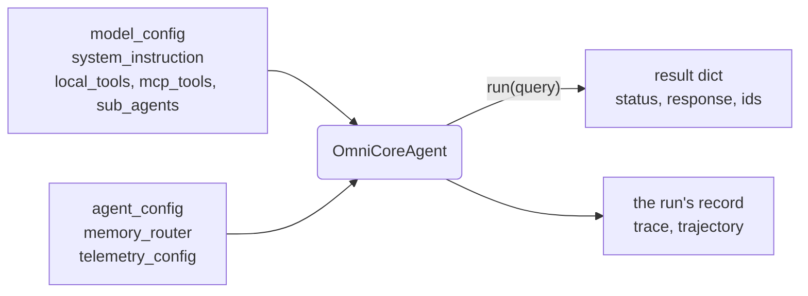

# OmniCoreAgent

`OmniCoreAgent` is the object you build. You give it a model, instructions and
the tools it may use; it runs the loop, keeps the conversation, guards the
input, and records every run. This page shows what goes into it, what comes out,
and what is already switched on before you ask for anything.



<Info>
New to OmniCoreAgent? The [quickstart](/docs/getting-started/quickstart) builds
your first agent in five minutes. Every output on this page is what the code
printed when it was run; the model's wording will differ on yours.
</Info>

## Build one and look inside

The agent below has one tool of yours. Before it runs, ask it which tools the
model will be offered; then run it and read the result.

```python
import asyncio
from omnicoreagent import OmniCoreAgent, ToolRegistry

tools = ToolRegistry()

@tools.register_tool("get_weather")
def get_weather(city: str) -> dict:
    """Get current weather for a city."""
    return {"city": city, "temp": "22C", "condition": "Sunny"}

async def main():
    agent = OmniCoreAgent(
        name="weather_desk",
        system_instruction="Use tools when they help. Answer in one plain sentence.",
        model_config={"provider": "openai", "model": "gpt-5.4-mini"},
        local_tools=tools,
    )

    offered = await agent.list_all_available_tools()
    print("tools:", [tool["name"] for tool in offered])

    result = await agent.run("Is it sunny in Lisbon right now?")
    for key in ("status", "termination_reason", "response", "session_id", "run_id", "trace_id"):
        print(f"{key}: {result[key]}")
    print("metric:", result["metric"])

    await agent.cleanup()

asyncio.run(main())
```

```text
tools: ['get_weather', 'ls', 'read_file', 'write_file', 'edit_file', 'insert_file', 'delete_file', 'move_file', 'clear_files', 'glob', 'grep', 'read_artifact', 'tail_artifact', 'search_artifact', 'list_artifacts']
status: success
termination_reason: stop
response: Yes—it's sunny in Lisbon right now.
session_id: omni_core_agent_weather_desk_59ebbaa6
run_id: run_403c8c1fd19d4ac2ad67329f73a4195f
trace_id: trace_c27309147dfe4d91a1d00e0f4bde1a4f
metric: Usage(requests=2, request_tokens=3020, response_tokens=32, total_tokens=3052, total_time=19.571500253980048, details={'cached_input_tokens': 1024})
```

Your one tool came with fourteen more. They are the agent's **workspace**: file
tools over its own folder (`ls` to `grep`), and the `*_artifact` tools that read
back a tool result too large to put in the conversation. Nobody asked for them;
they are on by default.

The run made two model calls: one that chose `get_weather`, one that answered
with its result. No `session_id` was given, so the run made one. Pass your own to
continue a conversation ([basic usage](/docs/how-to-guides/basic-usage)).

## Switch something on, see what changes

Most of the runtime is switched on by one setting. This asks the agent for its
tools under a few settings, without running the model:

```python
import asyncio
from omnicoreagent import OmniCoreAgent

async def tool_names(agent_config):
    agent = OmniCoreAgent(
        name="grower",
        system_instruction="You are a helpful assistant.",
        model_config={"provider": "openai", "model": "gpt-5.4-mini"},
        agent_config=agent_config,
    )
    names = {tool["name"] for tool in await agent.list_all_available_tools()}
    await agent.cleanup()
    return names

async def main():
    base = await tool_names({})
    print("default:", len(base), "tools")
    for setting in (
        {"enable_workspace_files": False},
        {"enable_subagents": True},
        {"governance_config": {"enabled": True, "sandbox_config": {"provider": "docker"}}},
    ):
        names = await tool_names(setting)
        print(setting, "-> added", sorted(names - base), "removed", len(base - names))

asyncio.run(main())
```

```text
default: 14 tools
{'enable_workspace_files': False} -> added [] removed 10
{'enable_subagents': True} -> added ['spawn_subagents'] removed 0
{'governance_config': {'enabled': True, 'sandbox_config': {'provider': 'docker'}}} -> added ['execute'] removed 0
```

A sandbox gives the agent an `execute` tool whose commands run in the sandbox,
not on your machine; sub-agents give it `spawn_subagents`. Turning the workspace
off removes its ten file tools; the artifact tools stay, because large tool
results still need somewhere to go.

<Note>
`list_all_available_tools()` lists your tools, MCP tools, the built-in ones and a
`delegate_<name>` tool per sub-agent. The `tools_retriever` tool that
`enable_advanced_tool_use` adds is offered inside the run and does not appear in
this list.
</Note>

## How it works

- **Constructing is cheap and checks everything.** `OmniCoreAgent(...)` opens no
  connection and calls no model, but it validates every setting: a typo in
  `agent_config` fails here, not halfway through a run.
- **The first run sets it up.** The model connection, memory, guardrail and tools
  are built on the first `run()` (or `list_all_available_tools()`, or
  `await agent.initialize()`). That is when `LLM_API_KEY` is read.
- **Each `run()` is one request.** It loads the session's history, calls the
  model, runs the tools it asks for (independent calls in one batch), and repeats
  until the model answers or a limit is reached. It saves the conversation, a
  durable record of the run, and a trace of every step.
- **It returns instead of raising.** A provider error, a limit or a blocked input
  comes back as a result with `status` `"error"` and a `termination_reason`.
  Setup and storage problems (a missing key, a bad setting, an unreachable
  database) raise.
- **`cleanup()` closes what it opened**: MCP connections and sub-agent workers.

## On before you ask

| Capability | Default | Change it with |
|---|---|---|
| The loop: tools, parallel batches, structured observations | on | always part of the agent |
| Session memory | on, in process memory | `memory_router=MemoryRouter("redis")`, `"sql"` or `"mongodb"` ([Memory](/docs/core-concepts/memory)) |
| Workspace files, in `./workspace` | on | `enable_workspace_files`, `workspace_config` ([Workspace](/docs/core-concepts/workspace-files)) |
| Large tool results saved to the workspace | on | `tool_offload` |
| Context kept under 100,000 tokens | on | `context_management` ([Context engineering](/docs/core-concepts/context-engineering)) |
| Prompt-injection guardrail on input and tool results | on | `guardrail_mode`: `full`, `input_only` or `off` ([Guardrails](/docs/core-concepts/guardrails)) |
| A trace of every run, on disk, kept 7 days | on | `telemetry_config` ([Observability](/docs/how-to-guides/observability)) |
| A durable run record, kept 30 days | on | `run_retention_days` ([Durable runs](/docs/core-concepts/durable-runs)) |
| Personal data redacted from the record | on | `privacy_config` |
| Policy: allow, ask or deny each capability | off | `governance_config` ([Security model](/docs/core-concepts/security-model)) |
| Sandboxed commands (`execute`) | off | `governance_config["sandbox_config"]` ([Execution](/docs/core-concepts/execution)) |
| Budgets in dollars or tokens | off | `governance_config["budgets"]` ([Budgets](/docs/reference/budgets)) |
| Sub-agents, skills, code mode, tool retrieval | off | `enable_subagents`, `enable_agent_skills`, `code_mode`, `enable_advanced_tool_use` |

Every one of these is a key in `agent_config`; the
[agent settings reference](/docs/reference/agent-config) has each with its
default. [Configuration](/docs/how-to-guides/configuration) shows how they fit
together.

## What it takes

| Argument | What it is |
|---|---|
| `name` | Required. The agent's name in its traces, records and workspace. |
| `system_instruction` | Required. What the agent is for; the start of its system prompt. |
| `model_config` | Required. `{"provider": ..., "model": ...}`, plus sampling settings ([Models](/docs/how-to-guides/models)). |
| `local_tools` | Your Python functions: a `ToolRegistry`, or a list of functions ([Local tools](/docs/core-concepts/local-tools)). |
| `mcp_tools` | MCP servers whose tools it may use ([MCP](/docs/core-concepts/mcp)). |
| `sub_agents` | Other agents it may hand a task to; each becomes a `delegate_<name>` tool ([Sub-agents](/docs/core-concepts/sub-agents)). |
| `agent_config` | How it runs: steps, limits, workspace, memory window, policy ([agent settings](/docs/reference/agent-config)). |
| `memory_router` | Where session history and run records live; in process memory by default. |
| `telemetry_config` | What a trace records and for how long ([telemetry settings](/docs/reference/telemetry-config)). |
| `telemetry_exporters` | Where finished traces are also sent: OTLP, LangSmith, Opik. |
| `debug` | Log each step in detail. |

The rest (`telemetry_store`, `telemetry_recorder`, `telemetry_stream`,
`telemetry_payload_store`, `prompt_builder`) replace built-in parts; see the
[OmniCoreAgent reference](/docs/reference/omnicoreagent).

## What you can ask of it

| To… | Call |
|---|---|
| Run a request | `run(query, session_id=None)`; stream its text with `stream(query)` or `run(..., on_event=callback)` |
| Continue a paused or crashed run | `resume(run_id)` |
| Redirect or stop a live run | `steer(run_id, message)`, `interrupt(run_id)` |
| Answer a person's decision | `resolve_approval(...)`, `grant_budget(...)`, `deny_budget(...)`, `budget_status(run_id)` |
| Read what a run did | `get_trajectory(trace_id)`, `get_run_trajectory(run_id)`, `get_trace(...)`, `get_run(run_id)`, `list_runs()` |
| Read or clear a conversation | `get_session_history(session_id)`, `clear_session_history(session_id)` |
| Grade runs and export them for training | `record_outcome(run_id, ...)`, `training_records(...)` |
| Connect or close | `connect_mcp_servers()`, `initialize()`, `cleanup()` |

Every method, with its signature, is in the
[OmniCoreAgent reference](/docs/reference/omnicoreagent).

## When things go wrong

<AccordionGroup>
  <Accordion title="ValueError: Unknown agent_config setting 'max_step'. Did you mean 'max_steps'?">
    Raised by the constructor for any key it does not know, with the closest
    match and the full list of settings:

    ```text
    ValueError: Unknown agent_config setting 'max_step'. Did you mean 'max_steps'? Settings: agent_name, agent_version, agents_md, code_mode, ...
    ```

    A key that 0.3 accepted and 0.4 removed says what replaced it; see
    [Upgrading](/docs/upgrading).
  </Accordion>
  <Accordion title="ValueError: sub_agents must be a list of agents, e.g. sub_agents=[researcher]">
    `sub_agents` takes a list of agent objects, even for one:
    `sub_agents=[researcher]`, not `sub_agents=researcher` or a name.
  </Accordion>
  <Accordion title="ValueError: LLM_API_KEY not found in environment variables">
    Raised by the first `run()`, not by the constructor: the key is read when
    the agent is set up. Export it in the shell that runs the script. See the
    [quickstart](/docs/getting-started/quickstart#when-things-go-wrong).
  </Accordion>
  <Accordion title="AttributeError: 'NoneType' object has no attribute 'switch_memory_store'">
    `switch_memory_store()` was called before the agent was set up, so it has no
    memory router yet. Pass the store you want to the constructor
    (`memory_router=MemoryRouter("redis")`), or call `await agent.initialize()`
    before switching.
  </Accordion>
  <Accordion title="The run returned status error instead of an answer">
    Read `termination_reason`: `provider_error` (the model call failed; the
    `response` says why), `max_steps` or `resource_limit` (a limit in
    `agent_config`), `safety_guard` (the guardrail blocked the input). The
    [basic usage](/docs/how-to-guides/basic-usage#when-things-go-wrong) page shows each.
  </Accordion>
</AccordionGroup>

## Next

<CardGroup cols={2}>
  <Card title="Basic usage" icon="book-open" href="/docs/how-to-guides/basic-usage">
    Sessions, streaming, reading a run back, and handling failures.
  </Card>
  <Card title="Configuration" icon="gear" href="/docs/how-to-guides/configuration">
    Model, agent, memory, workspace and telemetry settings in one place.
  </Card>
  <Card title="The harness" icon="layer-group" href="/docs/core-concepts/agent-harness">
    What the runtime does around the model, piece by piece.
  </Card>
  <Card title="Take the tour" icon="map" href="/docs/getting-started/tour">
    A policy that asks a person, a sandbox, a budget.
  </Card>
</CardGroup>
