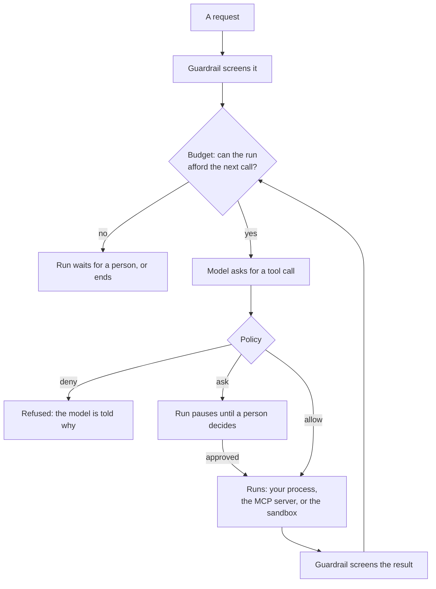

# Security Model

Text the model reads can steer it, so every tool call and command is a
request that has to be allowed first. This page shows the pieces, the
defaults, and how to turn governance on.

<Info>
Every output on this page is what the code printed when it was run. The
model's wording will differ on your run; the policy decisions will not.
</Info>

## The pieces



Every step is recorded in the run's trace, redacted for privacy.

| Piece | Does | Page |
|---|---|---|
| Policy | allow, ask or deny each request | [Policies](/docs/core-concepts/policies) |
| Approvals | a person decides an ask | [Approvals](/docs/core-concepts/approvals) |
| Sandbox | commands run in a container | [Execution](/docs/core-concepts/execution), [Sandbox providers](/docs/how-to-guides/sandbox-providers) |
| Budgets | caps spend per request, session, agent, app | [Budgets](/docs/core-concepts/budgets) |
| Guardrail | screens for prompt injection | [Guardrails](/docs/core-concepts/guardrails) |
| Privacy | redacts personal data | [Privacy](/docs/core-concepts/privacy) |
| Evidence | every decision in the trace | [Observability](/docs/how-to-guides/observability) |

Two independent layers: **governance decides** (every call passes the
policy before it runs) and **the sandbox contains** (`execute` commands run
in a container, not on your host).

## The defaults

**Governance is off by default:** no policy, no approvals, no budgets, no
sandbox (no `execute` tool). Every tool the agent has may be called.

| On without governance | Setting |
|---|---|
| Injection guardrail on requests and tool results | `guardrail_mode="full"` |
| Personal data redacted from traces | `privacy_config` |
| A trace of every run | `telemetry_config` |
| A run record, kept 30 days | `run_retention_days` |
| 50 steps per run, 180 s per tool call | `max_steps`, `tool_call_timeout` |
| File tools confined to the workspace | `workspace_config` |
| No API keys passed to host skill scripts | `skill_script_env` |

Every setting is in the [agent settings reference](/docs/reference/agent-config).

## Turn it on

Enable governance and pick a built-in profile:

```python
import asyncio
from omnicoreagent import OmniCoreAgent, ToolRegistry

tools = ToolRegistry()

@tools.register_tool("lookup_order")
def lookup_order(order_id: str) -> dict:
    """Look an order up."""
    return {"order_id": order_id, "status": "delivered", "total": 42.0}

async def main():
    agent = OmniCoreAgent(
        name="support",
        system_instruction="You help with orders. Answer in plain text, in one sentence.",
        model_config={"provider": "openai", "model": "gpt-5.4-mini"},
        local_tools=tools,
        agent_config={"governance_config": {"enabled": True, "profile": "interactive-dev"}},
    )
    result = await agent.run("Where is order 1042? Save a one-line note about it in notes.txt.")
    print(result["status"], "|", result["response"])

    trajectory = await agent.get_trajectory(result["trace_id"])
    print("governance:", trajectory["harness"]["governance"])
    print("security_warnings:", trajectory["harness"]["security_warnings"])
    for step in trajectory["steps"]:
        for call in step["tool_calls"]:
            for decision in call["governance"]:
                print(call["tool_name"], "->", decision["capability"], decision["effect"], decision["matched_rule_ids"])
    await agent.cleanup()

asyncio.run(main())
```

```text
success | Order 1042 is delivered, and I saved a one-line note in notes.txt.
governance: {'enabled': True, 'policy_hash': 'bb81a170ae379df29a222d4a5a566afe11e09dbca052578752e16cfadbb767a2'}
security_warnings: []
lookup_order -> tool.local.call allow ['allow_local_tools']
write_file -> workspace.files.write allow ['allow_workspace']
```

Each call is a request for a **capability**; the trajectory names the rule
that decided it, and the header carries the policy's hash.

To run commands in a sandbox too, add a provider:

```python
agent_config = {
    "governance_config": {
        "enabled": True,
        "profile": "interactive-dev",  # or "strict-production" with your own rules
        "sandbox_config": {"provider": "docker"},  # adds the execute tool
    },
}
```

Install the Docker extra with `pip install "omnicoreagent[docker]"`.

| | `permissive-dev` | `interactive-dev` | `strict-production` |
|---|---|---|---|
| No rule matched | allow | ask | deny |
| Your tools | allow | allow | deny |
| Workspace files | allow | allow (delete: ask) | deny |
| MCP tools | allow | ask | deny |
| Sandboxed commands | allow | allow | deny |
| Commands on the host | deny | ask | deny |
| Network, host files, package installs | deny | ask | deny |
| Sub-agents, background runs | allow | ask | deny |
| Reading secrets | deny | deny | deny |

Every rule: [policy reference](/docs/reference/policy). Your own rules:
[Policies](/docs/core-concepts/policies).

## What the Docker sandbox enforces

- No network unless the policy allows it (the dev profiles ask).
- Read-only root, unprivileged user, all capabilities dropped, no privilege
  escalation, memory, CPU and process limits.
- An in-memory working directory, removed with the container.
- Only the environment you set; never your credentials.
- Never mounted, whatever the policy says: the Docker socket, system
  directories, `~/.ssh`, `~/.aws` and similar.
- One container per run, removed when it ends or is cancelled.

For a boundary that does not share your host kernel, install gVisor and set
`"options": {"runtime": "runsc"}` in `sandbox_config`.

## Trust boundaries

| Runs where | Governed | Contained | Sees your credentials |
| --- | --- | --- | --- |
| `execute` commands | Yes | Yes (sandbox) | No |
| Skill scripts, with a sandbox | Yes | Yes (sandbox) | No |
| Skill scripts, no sandbox | Yes | No (your host) | No ([Skills](/docs/core-concepts/skills)) |
| Your own tools | Yes | No (your process) | Yes |
| MCP tools | Yes | The server's call | The server's call |
| `AGENTS.md` | n/a (text) | n/a | No |

Governance decides whether your tool runs, not what it does once it runs.

## Built-in protections

- Sub-agents of a governed agent are governed, under a policy derived from
  its own.
- `AGENTS.md` is guidance only; it cannot grant a permission
  ([AGENTS.md](/docs/core-concepts/agents-md)).
- A policy file the agent could write to is refused
  ([Policies](/docs/core-concepts/policies)).
- A policy is hashed when loaded; the hash is on every decision and trace.
- Sandbox files come back only as governed, bounded copies (no links, hidden,
  oversized or non-text files).
- The trace header lists `security_warnings`, such as
  `ungoverned_host_scripts` or `sandbox_unused_without_governance`
  ([Observability](/docs/how-to-guides/observability)).

## What is not protected

- **Anything your policy allows.** An allow rule for a dangerous capability is
  honoured.
- **Your own tools and host skill scripts** run with your privileges.
- **Data leaving through an allowed channel** (an MCP tool, a tool of yours, a
  sandbox with the network on). There is no data-flow tracking.
- **The host kernel**, when the sandbox uses plain Docker rather than gVisor.
- **Governance off.** Without it, no policy applies and the sandbox is unused.

## When things go wrong

<AccordionGroup>
  <Accordion title="A sandbox is configured but nothing runs in it">
    `sandbox_config` is set but `governance_config["enabled"]` is not `True`.
    The trace header says so:

    ```text
    sandbox_unused_without_governance: A sandbox is configured but governance is off, so nothing runs in it; enable governance to use it.
    ```

    Set `"enabled": True` next to `sandbox_config`.
  </Accordion>

  <Accordion title="ValueError: governance_config.profile must be one of ...">
    The profile name is not one of the three built-in profiles:

    ```text
    ValueError: governance_config.profile must be one of {'permissive-dev', 'interactive-dev', 'strict-production'}
    ```
  </Accordion>

  <Accordion title="A call the agent needs is refused or asked about">
    Read the call's `governance` entries in the trajectory: `matched_rule_ids`
    names the rule that decided it, and an empty list with `reason_code`
    `unknown_capability` means no rule matched and the profile's mode decided.
    [Policies](/docs/core-concepts/policies) shows how to add a rule.
  </Accordion>
</AccordionGroup>

## Next

<CardGroup cols={2}>
  <Card title="Policies" icon="scale-balanced" href="/docs/core-concepts/policies">
    Write rules, test that they match, and read each decision.
  </Card>
  <Card title="Approvals" icon="user-check" href="/docs/core-concepts/approvals">
    A person in the loop: pause, decide, resume.
  </Card>
  <Card title="Execution" icon="terminal" href="/docs/core-concepts/execution">
    The execute tool, skill scripts and code mode, and what governs each.
  </Card>
  <Card title="Sandbox providers" icon="box" href="/docs/how-to-guides/sandbox-providers">
    Docker, E2B, Modal, Daytona, Vercel and more.
  </Card>
  <Card title="Budgets" icon="coins" href="/docs/core-concepts/budgets">
    Put a price on a run, a session or an application.
  </Card>
  <Card title="Guardrails" icon="shield" href="/docs/core-concepts/guardrails">
    The injection screen, and what it does and does not catch.
  </Card>
  <Card title="Privacy" icon="user-secret" href="/docs/core-concepts/privacy">
    What personal data is redacted, and where.
  </Card>
  <Card title="Policy reference" icon="book" href="/docs/reference/policy">
    Every capability and every built-in rule.
  </Card>
</CardGroup>
