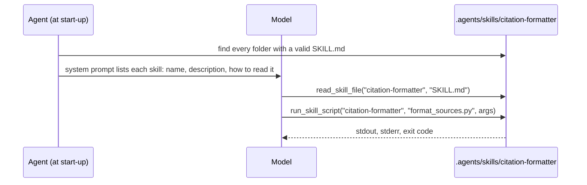

# Agent Skills

A skill is a folder: a `SKILL.md` that tells the agent how to do one kind of
task, and the scripts, references and templates that go with it. Put skills in
`.agents/skills/`, switch them on, and the agent reads a skill's instructions
when a request matches it and runs its scripts with a tool call.

Skills follow the [agentskills.io](https://agentskills.io/) format, so a skill
written for another agent works here too.

## Your first skill

<Steps>
  <Step title="Write the skill">
    A skill is a folder named after the skill, holding a `SKILL.md`:

    ```text
    .agents/skills/citation-formatter/
    ├── SKILL.md
    └── scripts/
        └── format_sources.py
    ```

    `SKILL.md` starts with YAML frontmatter. `name` and `description` are
    required, and `name` must equal the folder's name. The rest of the file is
    the instructions the agent reads:

    ```markdown
    ---
    name: citation-formatter
    description: Formats a list of sources as numbered citations.
    ---

    # Citation formatter

    Run `format_sources.py` with one argument per source, then give its output
    to the user under the line "Sources:", exactly as printed.
    ```

    The script is an ordinary program. It gets its input as command-line
    arguments and answers on standard output:

    ```python
    # .agents/skills/citation-formatter/scripts/format_sources.py
    import sys

    for number, source in enumerate(sys.argv[1:], start=1):
        print(f"[{number}] {source.strip()}")
    ```
  </Step>

  <Step title="Switch skills on">
    Run this from the folder that holds `.agents/`:

    ```python
    import asyncio
    from omnicoreagent import OmniCoreAgent

    async def main():
        agent = OmniCoreAgent(
            name="writer",
            system_instruction="You help with writing. Answer in plain text.",
            model_config={"provider": "openai", "model": "gpt-5.4-mini"},
            agent_config={"enable_agent_skills": True},
        )
        result = await agent.run(
            "Cite these two sources for me: the Python docs at python.org, "
            "and PEP 8 at peps.python.org/pep-0008."
        )
        print(result["response"])

        trajectory = await agent.get_trajectory(result["trace_id"])
        for step in trajectory["steps"]:
            for call in step["tool_calls"]:
                print("step", step["step"], "->", call["tool_name"], call["arguments"], call["outcome"])
        await agent.cleanup()

    asyncio.run(main())
    ```

    ```text
    Sources:
    [1] Python docs, python.org
    [2] PEP 8, peps.python.org/pep-0008
    step 1 -> read_skill_file {'skill_name': 'citation-formatter', 'file_path': 'SKILL.md'} success
    step 2 -> run_skill_script {'skill_name': 'citation-formatter', 'script_name': 'format_sources.py', 'args': ['Python docs, python.org', 'PEP 8, peps.python.org/pep-0008'], 'timeout': 30} success
    ```

    The model read the skill's instructions, then ran its script with the
    arguments it chose. Its wording, and how it splits the sources into
    arguments, will differ on your run.
  </Step>
</Steps>

## How it works



1. **Found once, when the agent is built.** Every folder under the skills
   directory with a valid `SKILL.md` becomes a skill. A skill added later is
   seen by the next agent you build.
2. **Listed in the system prompt.** Each skill appears by name and
   description, with the tool call that reads it. The catalog shows tool
   calls, never host paths, so the model does not try to run a skill's script
   with a shell command:

    ```text
    - name: citation-formatter
      description: Formats a list of sources as numbered citations.
      instructions: read_skill_file(skill_name="citation-formatter", file_path="SKILL.md")
    Run a skill's scripts with run_skill_script(skill_name, script_name, args), not execute: the skill's files are not in the sandbox's working directory.
    ```

3. **Read and run through two tools.**

| Tool | Arguments | What it does |
|---|---|---|
| `read_skill_file` | `skill_name`, `file_path` | Reads any file in the skill's folder: `SKILL.md`, `references/GUIDE.md`, `assets/template.txt`. Paths outside the folder are refused. |
| `run_skill_script` | `skill_name`, `script_name`, `args` (list of strings), `timeout` (seconds, default 30) | Runs a script from the skill's `scripts/` folder. `script_name` is relative to `scripts/` (`"format_sources.py"`). Returns `stdout`, `stderr`, `exit_code`, and where it ran (`execution_surface`). |

### The skill folder

```text
.agents/skills/my-skill/
├── SKILL.md        # frontmatter + the instructions the agent reads
├── scripts/        # what run_skill_script can run
├── references/     # longer documents the agent reads when it needs them
└── assets/         # templates, examples, other files
```

Only `SKILL.md` is required. Frontmatter fields:

| Field | Required | Rules |
|---|---|---|
| `name` | yes | Equal to the folder's name; lowercase letters, digits and single hyphens, at most 64 characters |
| `description` | yes | What the skill does and when to use it, at most 1024 characters. The model chooses skills by it, so say when to use this one |
| `license` | no | Text |
| `compatibility` | no | Environment requirements, at most 500 characters |
| `metadata` | no | One level of `key: value` pairs, indented under `metadata:` |
| `allowed-tools` | no | Space-separated tool names. Parsed and kept with the skill; it does not restrict what the agent may call (a [policy](/docs/core-concepts/security-model) does that) |

### Scripts in any language

The interpreter is chosen by the file's extension:

| Extension | On the host | In a sandbox |
|---|---|---|
| `.py` | the Python running your agent | `python3` |
| `.sh` | `bash` | `sh` |
| `.bash` | `bash` | `bash` |
| `.js`, `.mjs`, `.cjs` | `node` | `node` |
| `.ts` | `ts-node` | `ts-node` |
| `.rb` | `ruby` | `ruby` |
| `.pl` | `perl` | `perl` |

The interpreter must be installed where the script runs. A file with any other
extension is run directly, so it needs a shebang line and its executable bit.

### Where a script runs, and what it can see

- **With a sandbox** (governance on, with a sandbox that runs commands): the
  skill's files are copied into the sandbox under `/workspace/.skills/<name>/`
  and the script runs there, unable to see the host. A skill copied in may be
  at most 20 MB. See [Execution](/docs/core-concepts/execution).
- **Without one**: the script runs on the host, in the skill's folder, as
  your process's user.

On the host a script does **not** inherit the agent's environment. It gets
`PATH`, `HOME`, the locale (`LANG`, `LC_*`), `TMPDIR` and `TERM`, and nothing
else, so it cannot read `LLM_API_KEY` or any other secret your process holds.
Pass a variable a skill needs by name with `skill_script_env`:

```python
agent_config = {
    "enable_agent_skills": True,
    "skill_script_env": ["MY_SERVICE_URL"],
}
```

A skill script that checks what it can see, run from a process that has both
variables set:

```python
import os

for name in ("LLM_API_KEY", "MY_SERVICE_URL"):
    print(name, "is set" if name in os.environ else "is not set")
```

Without `skill_script_env`, it printed:

```text
LLM_API_KEY is not set
MY_SERVICE_URL is not set
```

With `"skill_script_env": ["MY_SERVICE_URL"]`:

```text
LLM_API_KEY is not set
MY_SERVICE_URL is set
```

Under governance, reading a skill's files is the capability `skill.files.read`
and running a script is `skill.script.run` (high risk, on the `host` or
`sandbox` surface), so a policy can allow, ask about, or deny each. The
built-in development profiles allow both.

<Warning>
With governance off, a skill script runs on the host with no policy and no
sandbox. The agent records the warning `ungoverned_host_scripts` in every run's
header and logs it once at start-up. Only switch on skills you trust, or turn
on governance with a sandbox ([security model](/docs/core-concepts/security-model)).
</Warning>

## Options

| Setting (in `agent_config`) | Default | What it does |
|---|---|---|
| `enable_agent_skills` | `False` | Find skills, list them in the system prompt, and give the model `read_skill_file` and `run_skill_script` |
| `skills_dir` | `None` (`./.agents/skills`, from the working directory) | Where skills are found |
| `skill_script_env` | `[]` | Environment variables a host script receives beyond the minimal set |
| `tool_call_timeout` | `180` | Seconds any tool call may take, including a script, whatever `timeout` the model passes |

Every setting is in the [agent settings reference](/docs/reference/agent-config).

## Writing a good skill

- **Make the description a trigger.** The model sees only the name and
  description until it reads the skill. "Formats a list of sources as numbered
  citations" is chosen for a citation request; "Utilities" is not.
- **Keep `SKILL.md` short, and link out.** Put long material in `references/`
  and say in `SKILL.md` when to read it; the agent reads it with
  `read_skill_file` only when needed.
- **Say how to run each script**: its name, its arguments, and what to do
  with the output.
- **Take input as arguments and answer on standard output.** Avoid hard-coded
  paths: a script may run on the host or in a sandbox. Exit non-zero on
  failure; the model sees `stderr` and the exit code.

## When things go wrong

The agent logs to the `omnicoreagent` logger and prints nothing on its own.
To see the warnings below, turn logging on:

```python
import logging

logging.basicConfig(level=logging.WARNING)
```

<AccordionGroup>
  <Accordion title="The agent never uses my skill">
    Check that the skill was found. Discovery skips a folder, with a warning,
    when its `SKILL.md` has no frontmatter, lacks `name` or `description`, or
    names a different skill than its folder:

    ```text
    WARNING omnicoreagent: Skill name mismatch: directory 'renamed-folder' vs frontmatter 'other-name'
    ```

    Also check that the skills directory is where you think: the default
    `.agents/skills` is relative to the working directory the agent was built
    in. Set `skills_dir` to an absolute path to be sure. If the skill is found
    but not chosen, make its `description` say when to use it.
  </Accordion>

  <Accordion title="Governance is off: skill scripts run on the host with no policy and no sandbox.">
    Logged once when the agent starts, and recorded in each run's header as
    `ungoverned_host_scripts`. It is a warning, not an error: scripts still
    run. Turn on governance, with a sandbox, to contain them.
  </Accordion>

  <Accordion title="Script not found / Skill not found / Access outside skill directory">
    The tool returns an error to the model, which usually corrects itself.
    What the model sees:

    ```text
    {'status': 'error', 'message': 'Script not found: missing.py'}
    {'status': 'error', 'message': "Skill 'nope' not found"}
    {'status': 'error', 'message': 'Access outside skill directory is not allowed'}
    ```

    `script_name` is relative to `scripts/`: `"format_sources.py"`, not
    `"scripts/format_sources.py"`.
  </Accordion>

  <Accordion title="My script cannot find an API key or setting">
    On the host a script gets only a minimal environment. Name the variables it
    needs in `skill_script_env`.
  </Accordion>

  <Accordion title="Execution timed out after 30s">
    The model chose the default `timeout`. Say in `SKILL.md` how long the
    script takes and which `timeout` to pass. On the host, a timed-out script
    is killed together with every process it started.
  </Accordion>
</AccordionGroup>

## Next

<CardGroup cols={2}>
  <Card title="AGENTS.md" icon="file-lines" href="/docs/core-concepts/agents-md">
    A project's own instructions for the agent, in every run.
  </Card>
  <Card title="Execution" icon="terminal" href="/docs/core-concepts/execution">
    Where code runs: sandboxes, skill scripts and code mode.
  </Card>
  <Card title="Security model" icon="shield-halved" href="/docs/core-concepts/security-model">
    Policies that allow, ask about or deny running a script.
  </Card>
  <Card title="Workspace files" icon="folder-open" href="/docs/core-concepts/workspace-files">
    Where the agent keeps the files it makes.
  </Card>
</CardGroup>
