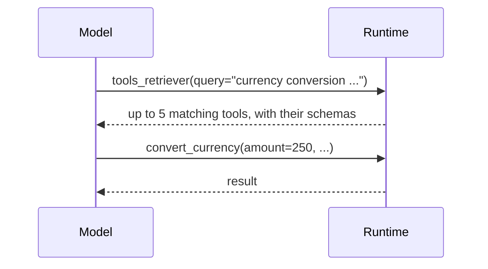

# Many Tools: Tool Search

Every tool's name, description and schema is sent to the model on every
step. With a few tools that is nothing; with hundreds it fills the context and
the model chooses worse. Turn on tool search and the model is sent one tool,
`tools_retriever`, instead of your catalog. It describes what it needs, and the
matching tools are offered from the next step.



<Info>
The output below is what the code printed when it was run. The model's query
and wording will differ on your run.
</Info>

## Thirty-three tools, one question

```python
import asyncio
from omnicoreagent import OmniCoreAgent, ToolRegistry

tools = ToolRegistry()

# 32 record tools, and one that answers the question.
for area in ["billing", "shipping", "inventory", "crm", "hr", "payroll", "support", "analytics"]:
    for action in ["create", "update", "delete", "export"]:
        def make(area=area, action=action):
            def tool(record_id: str) -> str:
                return f"{action} {area} {record_id}: ok"
            tool.__doc__ = f"{action.title()} a {area} record."
            return tool
        tools.register_tool(f"{action}_{area}_record")(make())

@tools.register_tool("convert_currency")
def convert_currency(amount: float, from_currency: str, to_currency: str) -> dict:
    """Convert an amount of money from one currency to another at today's rate."""
    rate = {("USD", "EUR"): 0.92}.get((from_currency, to_currency), 1.0)
    return {"amount": round(amount * rate, 2), "currency": to_currency}

async def main():
    agent = OmniCoreAgent(
        name="ops",
        system_instruction="Use tools to answer. Answer in plain text, in one sentence.",
        model_config={"provider": "openai", "model": "gpt-5.4-mini"},
        local_tools=tools,
        agent_config={"enable_advanced_tool_use": True},
    )
    result = await agent.run("How much is 250 US dollars in euros?")
    print(result["response"])

    trajectory = await agent.get_trajectory(result["trace_id"])
    for step in trajectory["steps"]:
        for call in step["tool_calls"]:
            print("step", step["step"], "->", call["tool_name"], call["arguments"], call["outcome"])
    await agent.cleanup()

asyncio.run(main())
```

```text
250 US dollars is 230 euros.
step 1 -> tools_retriever {'query': 'currency conversion USD to EUR current rate 250 US dollars in euros'} success
step 2 -> convert_currency {'amount': 250, 'from_currency': 'USD', 'to_currency': 'EUR'} success
```

The model never saw the 33 application tools up front. In step 1 it searched;
in step 2 it called the tool the search returned.

## How it works

1. At the start of each run, the runtime builds a catalog of every tool the
   agent has: your local tools, MCP tools, and the harness's own.
2. Some stay visible without a search: `tools_retriever` itself, the workspace
   tools (`ls`, `read_file`, `write_file`, `edit_file`, `insert_file`,
   `delete_file`, `move_file`, `clear_files`, `glob`, `grep`), the artifact
   tools (`read_artifact`, `tail_artifact`, `search_artifact`,
   `list_artifacts`), `read_skill_file`, `run_skill_script`,
   `spawn_subagents`, and each `delegate_<name>` tool for a sub-agent.
3. Everything else is hidden until found: your tools, MCP tools, code mode's
   `run_code`, and the sandbox's `execute`.
4. `tools_retriever(query)` ranks the hidden tools by
   [BM25](https://en.wikipedia.org/wiki/Okapi_BM25) over each tool's name,
   description and parameter schema, and returns up to five that match at
   least one word of the query. `snake_case` and `camelCase` names are split
   into words, so `convert_currency` matches "currency".
5. The tools it returned are offered from the **next** model step, for the
   rest of the run. A call in the same batch as the search cannot use them.

The search is lexical, not semantic: it matches words, not meanings. It runs in
memory, needs no service or index to maintain, and returns the same tools for
the same query and catalog.

## Options

| Setting | Default | What it does |
|---|---|---|
| `agent_config["enable_advanced_tool_use"]` | `False` | Hide the catalog behind `tools_retriever`. |

That is the only setting. The rest of the agent's settings are in the
[agent settings reference](/docs/reference/agent-config).

## Write tools that can be found

- Put the words a model would search for in the **description**:
  "Convert an amount of money from one currency to another" is found by
  "currency", "convert" and "money".
- Name tools by what they do (`convert_currency`), not by a system's internal
  code (`fx_v2_proc`).
- Keep it on only when the catalog is large. With a handful of tools, the
  extra search step costs a model turn and gains nothing.

## When things go wrong

<AccordionGroup>
  <Accordion title="The model says it cannot do something a tool could">
    The search found nothing. It returns only tools that share a word with the
    query, and the model is told to try a more specific query when nothing
    relevant comes back. Put the words users and models actually say into the
    tool's description.
  </Accordion>

  <Accordion title="Tool '...' is not available; discover it first if hidden">
    The model called a hidden tool by name without searching for it first, or
    in the same batch as the search. The call is rejected with this message,
    and the model can search for it and call it on the next step.
  </Accordion>
</AccordionGroup>

## Next

<CardGroup cols={2}>
  <Card title="Local tools" icon="wrench" href="/docs/core-concepts/local-tools">
    Your functions as tools: schemas, results, errors.
  </Card>
  <Card title="MCP tools" icon="plug" href="/docs/core-concepts/mcp">
    Bring in a server's tools; they are searchable too.
  </Card>
  <Card title="Code mode" icon="code" href="/docs/core-concepts/code-mode">
    Many calls in one step, from a short Python program.
  </Card>
  <Card title="Read the trajectory" icon="magnifying-glass-chart" href="/docs/how-to-guides/observability">
    Every search, and every call it led to, is on the record.
  </Card>
</CardGroup>
